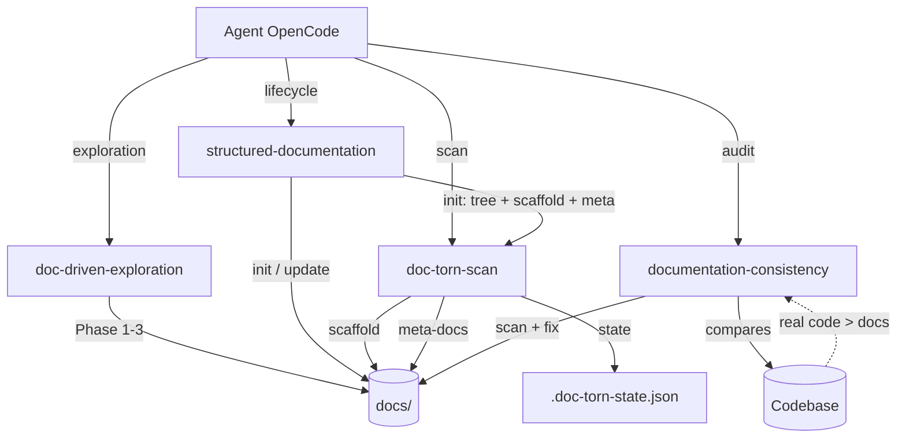

# Doc-Torn — Agent Guide

## Business Stakes

OpenCode project providing structured documentation skills to solve the problem of outdated technical documentation. Designed for development teams that want documentation always in sync with the code. Impact: eliminates documentation drift, standardizes structure, saves hours of research per feature.

## Skills

- [structured-documentation](skills/structured-documentation/SKILL.md) — Core lifecycle: init + update, L0→L3 templates
- [doc-driven-exploration](skills/doc-driven-exploration/SKILL.md) — Doc-first exploration: read docs before opening any code file
- [documentation-consistency](skills/documentation-consistency/SKILL.md) — Full doc vs code audit with auto-fix. Real code > docs.

## Features

- [structured-documentation](docs/features/structured-documentation/README.md) — Core lifecycle docs
- [doc-driven-exploration](docs/features/doc-driven-exploration/README.md) — Doc-first exploration docs
- [documentation-consistency](docs/features/documentation-consistency/README.md) — Audit + auto-fix docs
- [doc-torn-scan](docs/features/doc-torn-scan/README.md) — Go CLI tool for iterative feature-by-feature documentation

## Architecture in 30s

See `README.md` for full details.

## Agent Rules

### Every search → `doc-driven-exploration`
Load the doc skeleton (architecture, glossary, dependency matrix, dev-process) before opening any code.

### Before each feature → `doc-driven-exploration`
Read the doc skeleton (architecture, glossary, dependency matrix, dev-process), then navigate to relevant feature docs.

### After each feature → `structured-documentation update`
Create/update feature doc, sub-features, dependency matrix, definitions.

### Code modified/tested/completed → `documentation-consistency`
Full audit of all docs against real code. Auto-fix discrepancies.

### During reasoning if docs don't match code → `documentation-consistency`
Stop, audit, fix docs to reflect code reality.

### Before commit → `documentation-consistency`
Full audit of all docs against real code. Auto-fix discrepancies.

## Key Definitions

See `docs/user/definitions.md` for the full glossary.