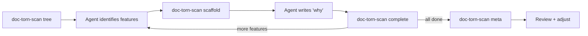

# doc-torn

**Project that provides structured documentation skills for AI coding agents.**

This repository contains skills that maintain structured documentation always in sync with the code, following a hierarchy (L0 → L1 → L2 → L3) with an explicit dependency matrix between features.

**Skills:**
- [structured-documentation](skills/structured-documentation/SKILL.md) — core lifecycle: init + update, L0→L3 hierarchy
- [doc-driven-exploration](skills/doc-driven-exploration/SKILL.md) — documentation-driven exploration: read docs before touching code
- [documentation-consistency](skills/documentation-consistency/SKILL.md) — full audit of all docs against code with auto-fix

**Tool:**
- [doc-torn-scan](tools/doc-torn-scan/) — Go binary for iterative feature-by-feature documentation (tree scan, scaffold generation, meta-doc generation)

## Installation

### Prerequisites
- **Go 1.23+** — to build `doc-torn-scan`
- **Git** — to clone hooks and track doc changes

### One-shot Install (all harnesses)

Copy this prompt to any AI coding agent — it will adapt to its own platform:

> Install doc-torn for your platform: clone https://github.com/Anhydrite/doc-torn in /opt/doc-torn, register the 3 skills (structured-documentation, doc-driven-exploration, documentation-consistency), and build the doc-torn-scan binary.

### Per-Harness Guides

- [OpenCode](install/opencode.md)
- [Claude Code (Anthropic)](install/claude-code.md)
- [Codex CLI (OpenAI)](install/codex-cli.md)
- [Gemini CLI (Google)](install/gemini-cli.md)
- [GitHub Copilot CLI](install/copilot-cli.md)

### doc-torn-scan Binary

Optional — the `structured-documentation` skill auto-installs it when missing (`which doc-torn-scan || go build ...`). To build manually:

```bash
cd tools/doc-torn-scan && go build -o ~/.local/bin/doc-torn-scan .
```

## Usage

The agent selects and loads the relevant skill based on the task:

| Task | Load | Then |
|------|------|------|
| Document a codebase for the first time | `structured-documentation` (init mode) | Follows the iterative doc-torn-scan workflow |
| Before implementing a new feature | `doc-driven-exploration` | Reads skeleton + feature docs before opening code |
| After completing a feature | `structured-documentation` (update mode) | Syncs docs, recalculates dependencies, updates AGENTS.md |
| Periodically or before release | `documentation-consistency` | Full audit of all docs against code with auto-fix |

### Companion: doc-driven-exploration

Every feature request should start with [doc-driven-exploration](skills/doc-driven-exploration/SKILL.md):
1. Load the documentation skeleton (architecture, glossary, dependency matrix, dev-process)
2. Navigate to relevant feature docs by filename
3. Read feature docs thoroughly (L1 → L2 → L3)
4. Only then reach for source code — and only if docs are insufficient
5. Update docs and definitions.md with findings

### Companion: documentation-consistency

Run [documentation-consistency](skills/documentation-consistency/SKILL.md) for periodic or pre-release audits:
1. Scans all docs against real code line by line
2. Detects drift: missing files, outdated descriptions, wrong dependency info
3. Auto-fixes discrepancies found — real code always wins
4. Suggested cadence: after any completed feature, before any commit, or whenever docs feel stale

### Quick start in a project

Place `examples/AGENTS.md` at your project root and copy the git hooks:

```bash
cp examples/AGENTS.md /path/to/your/project/AGENTS.md
cp examples/hooks/* /path/to/your/project/.git/hooks/
chmod +x /path/to/your/project/.git/hooks/pre-commit
chmod +x /path/to/your/project/.git/hooks/post-commit
```

## Documentation Hierarchy (L0 → L3)

Documentation follows a 4-level hierarchy that separates concerns by abstraction level. Each level answers a different question:

| Level | File | Reader | Answers |
|-------|------|--------|---------|
| **L0** | `docs/README.md` | Anyone | "What is this project?" — one-line summary, architecture diagram, feature list. 5-minute read. |
| **L1** | `docs/features/<name>/README.md` | Feature developer | "What does this feature do?" — objective, logic, dependencies, API, key files. |
| **L2** | `docs/features/<name>/sub-features/*.md` | Implementer | "What are the details?" — edge cases, business rules, sub-flows. |
| **L3** | `docs/features/<name>/implementation/*.md` | Maintainer | "Why was it done this way?" — technical decisions, rationale, tradeoffs. |

The hierarchy lets readers skip what they don't need: a new joiner reads L0, a developer reads L1+L2, a maintainer reads L3. The same hierarchy applies across all features — each feature under `docs/features/` has its own L1, L2, and L3 files.

## Repository Structure

```
skills/
  structured-documentation/       # Skill: init + update lifecycle
  doc-driven-exploration/         # Skill: read docs before touching code
  documentation-consistency/      # Skill: full doc audit against code
tools/
  doc-torn-scan/                  # Go binary: iterative doc scanner
    main.go                        # Entrypoint
    state/                         # State file persistence
    scan/                          # Filesystem traversal
    generate/                      # Markdown + meta-doc generation
    cmd/                           # CLI handlers
examples/
  AGENTS.md                        # Template for projects using doc-torn
  hooks/                           # Git hooks (pre-commit, post-commit)
```

## Project files

```
AGENTS.md                         # Agent cheat sheet: stakes, features index, rules
tools/doc-torn-scan/               # Go binary for iterative doc scanning
skills/
  structured-documentation/        # init + update lifecycle
  doc-driven-exploration/          # doc-first exploration (read before code)
  documentation-consistency/       # full doc vs code audit + auto-fix
docs/
  README.md                        # L0: Lightning overview (5 min)
  architecture/
    architecture.md                 # Functional blocks, flows, boundaries
    dependency-matrix.md            # Dependencies between features
  features/
    <feature-name>/
      README.md                    # L1: Main feature
      sub-features/
        <detail>.md                # L2: Sub-feature
      implementation/
        <detail>.md                # L3: Implementation detail
  user/
    definitions.md                 # Evolving business glossary
    dev-process.md                 # Dev conventions, validation practices
examples/
  AGENTS.md                        # Template for projects
  hooks/                           # Git hooks templates
```

## Lifecycle



## License

MIT
