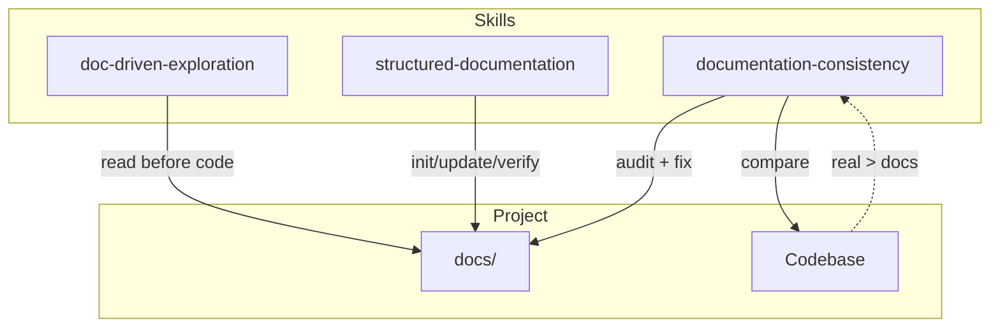

# Doc-Torn: Documentation Skills Project — Design Spec

## Summary

A project providing OpenCode skills for structured, always-in-sync documentation.
Core lifecycle: **init → read → dev → update → verify → audit**.
Companion skills enforce doc-first exploration and systematic consistency.

## Skills

| Skill | File | Purpose |
|-------|------|---------|
| structured-documentation | `skills/structured-documentation/SKILL.md` | Core lifecycle: init/read/update/verify modes, L0→L3 templates |
| doc-driven-exploration | `skills/doc-driven-exploration/SKILL.md` | Doc-first workflow: read docs before any code search |
| documentation-consistency | `skills/documentation-consistency/SKILL.md` | Full audit of all docs against real code with auto-fix |

### structured-documentation Modes

| Mode | When | Action |
|------|------|--------|
| `init` | First time | Create tree, L0, architecture, L1 features, AGENTS.md |
| `read` | Before each feature | Load existing docs to understand the ecosystem |
| `update` | After each feature | Update impacted docs, recalculate dependencies, refresh AGENTS.md |
| `verify` | Periodically / before release | Detect doc drift from code |

### doc-driven-exploration Phases

| Phase | Action | Rule |
|-------|--------|------|
| 1 | Load skeleton (4 files) | Docs only, no code |
| 2 | Navigate to feature docs | `docs/features/**/*.md` only |
| 3 | Read feature docs (L1→L2→L3) | All levels, no skipping |
| 4 | Code as last resort | Only if docs insufficient |
| 5 | Update docs | Fill gaps found |
| 6 | Handle terms + definitions.md | Ask user once if unclear |

### documentation-consistency Steps

| Step | Action | Auto-fix |
|------|--------|----------|
| 1 | Load doc skeleton | Reference only |
| 2 | Scan every feature doc | Yes — fix references, add missing |
| 3 | Scan codebase for undocumented | Yes — create missing feature docs |
| 4 | Verify dependency matrix | Yes — add/remove rows |
| 5 | Verify definitions.md | Yes — add missing terms |
| 6 | Auto-fix all gaps | Write now, no to-do list |
| 7 | Generate drift report | Summary of changes |

## Project Files

```
AGENTS.md                         # Agent cheat sheet: stakes, skills index, rules
README.md                          # Installation, usage, skills overview
SPEC.md                            # This file: design spec
skills/
  structured-documentation/        # Core lifecycle skill
  doc-driven-exploration/          # Doc-first exploration skill
  documentation-consistency/       # Audit + auto-fix skill
```

## Architecture



## Core Principles

1. **Real code > documentation** — when they disagree, update docs
2. **Sync after every feature** — documentation is never outdated
3. **Read before every feature** — understand the ecosystem before implementing
4. **Lightweight templates** — enough structure, no bureaucracy
5. **General to detailed** — L0 → L1 → L2 → L3
6. **Why, not how** — code is the reference for comments
7. **Audit regularly** — systematic consistency checks prevent drift

## Templates

### L0 (docs/README.md)
- One-line summary
- Architecture diagram (Mermaid `graph TD`)
- Major features (links)
- External dependencies

### L1 (docs/features/<name>/README.md)
- Functional objective
- Technical logic
- Dependencies (upstream / downstream)
- API / Interface
- Key files

### Architecture (docs/architecture/architecture.md)
- Block diagram (Mermaid `graph TD`)
- Data flows (Mermaid `sequenceDiagram`)
- Key boundaries

### AGENTS.md (project root)
- Business stakes (1-3 lines)
- Skills / features index with links
- Workflow rules referencing all skills

### L2/L3 (sub-features/ and implementation/)
- No strict template
- Explain WHY, not HOW
- Why this choice, edge case, business rule

## TDD Results

- **RED**: Baseline agent produced 4 cross-cutting files, no feature isolation, no hierarchy, no dependency matrix, no glossary
- **GREEN**: Agent with structured-documentation produced 17 files in L0→L1→L2→L3 structure with matrix, definitions, dev-process
- **REFACTOR**: Update mode tested under time pressure — all steps followed, bugs documented
- **Evolution**: Companion skills (doc-driven-exploration, documentation-consistency) added post-v1 to enforce doc-first discipline and systematic audit
