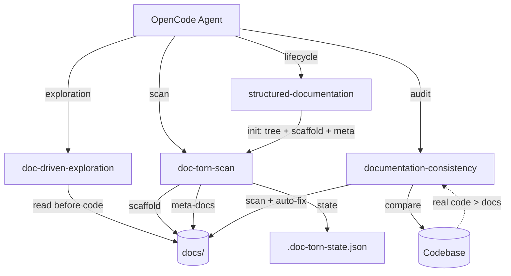

# Doc-Torn

## In one line

OpenCode skill suite that keeps technical documentation always in sync with code through a structured hierarchy (L0→L3), doc-first exploration discipline, and systematic consistency audits.

## Architecture

## Major Features

- [structured-documentation](features/structured-documentation/README.md) — Full documentation lifecycle: init, read, update, verify. L0→L3 hierarchy with templates.
- [doc-driven-exploration](features/doc-driven-exploration/README.md) — Enforces reading documentation before any code search or feature work.
- [documentation-consistency](features/documentation-consistency/README.md) — Full audit of all docs against real code with auto-fix and drift reporting.

## Tools

- [doc-torn-scan](../tools/doc-torn-scan/) — Go binary for iterative feature-by-feature documentation. Handles tree scanning, state persistence, markdown scaffolding, and meta-doc generation.

## External Dependencies

- **OpenCode** — runtime environment for the skills
- **superpowers** (optional) — automatic skill discovery and loading
- **Go 1.23+** — to build doc-torn-scan
