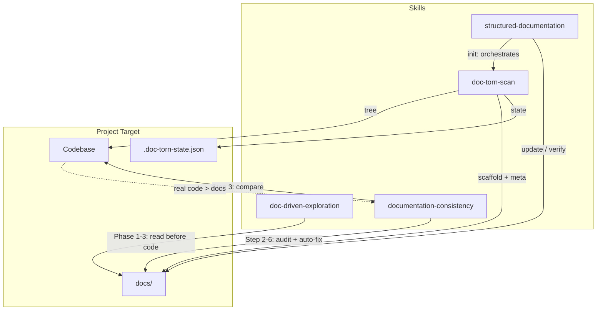
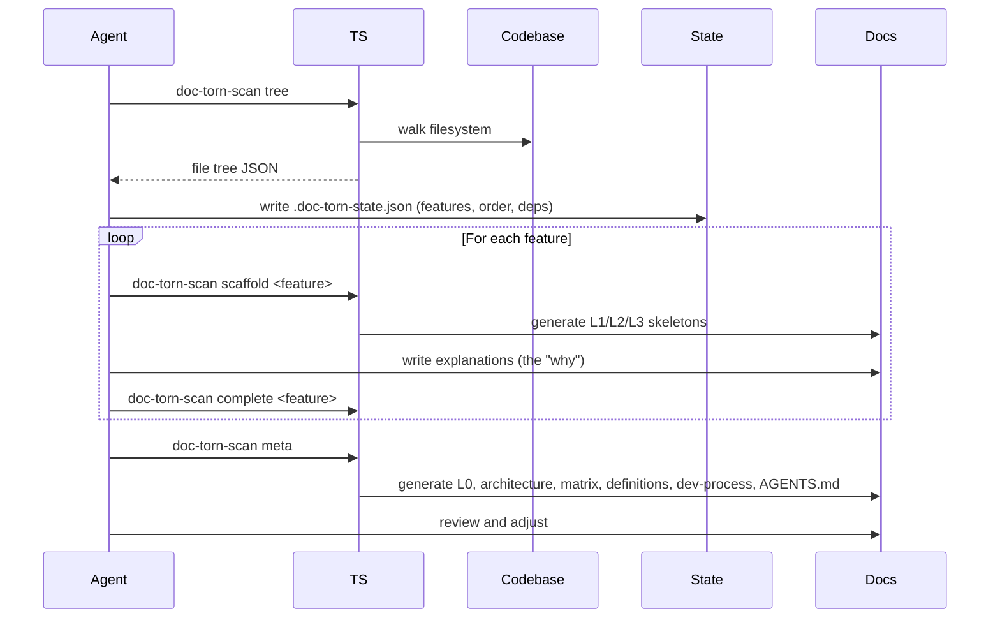
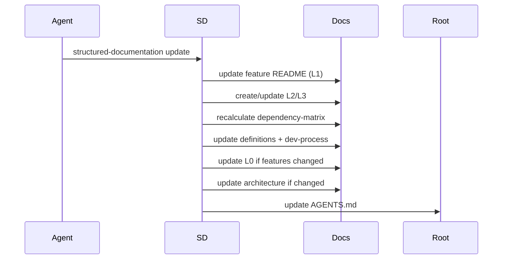
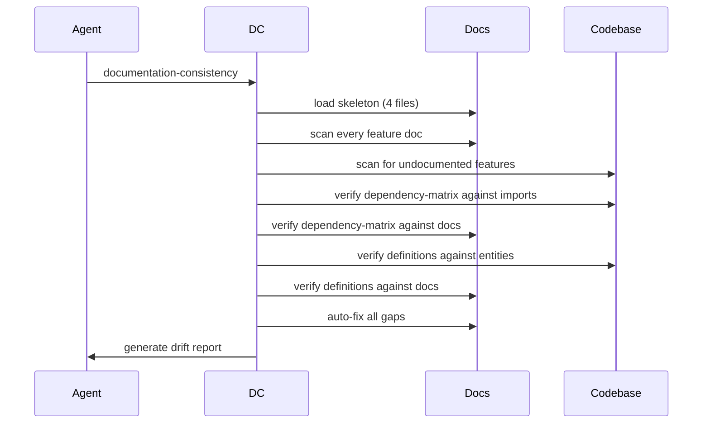

# Functional Architecture

## Block Diagram

## Data Flows

### Init flow (first-time documentation)

### Update flow (after a feature)

### Consistency audit flow

## Key Boundaries

- **Skills are Markdown, tool is Go** — `skills/<name>/SKILL.md` files are the skill definitions. `tools/doc-torn-scan/` is a Go binary for filesystem scanning and doc generation.
- **Examples are not features** — `examples/AGENTS.md` and `examples/hooks/` are project templates for consumers of doc-torn, not internal features.
- **doc-torn-scan is a CLI tool, not a skill** — it does not use the OpenCode skill system. It is invoked directly by the agent during `structured-documentation init`.
