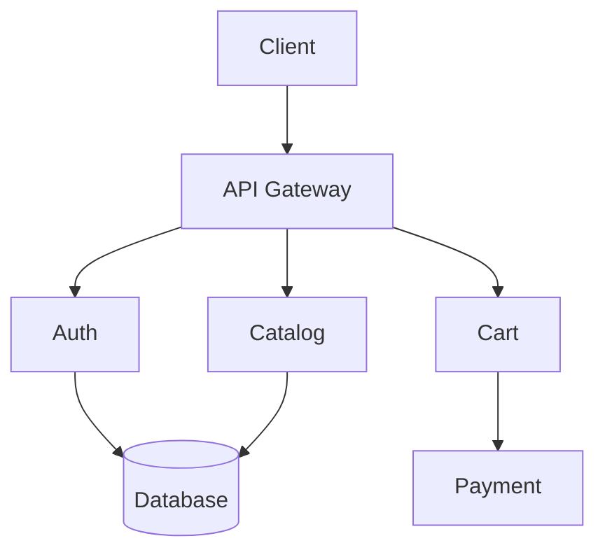

# <Project> — Agent Guide

## Business Stakes
<!-- Ultra condensed: why this project exists, its business importance -->
<1-3 lines: problem solved, target audience, financial or strategic impact>

## Features
<!-- Generated by structured-documentation init/update — index of all features -->
<!-- Links to docs/features/<name>/README.md -->
- [Feature A](docs/features/feature-a/README.md) — <1 line: objective, key dependencies>
- [Feature B](docs/features/feature-b/README.md) — <1 line>

## Architecture in 30s
<!-- Generated by structured-documentation — minimal Mermaid diagram -->

See `docs/architecture/architecture.md` for the full diagram.

## Agent Rules

### Every search → doc-driven-exploration
Load the doc skeleton (architecture, glossary, dependency matrix, dev-process) before opening any code.

### Before each feature → structured-documentation `read`
Read docs/README.md, architecture/, dependencies of impacted features.

### After each feature → structured-documentation `update`
Create/update feature doc, sub-features, dependency matrix, definitions, AGENTS.md.

### Code modified/tested/completed → documentation-consistency
Full audit of all docs against real code. Auto-fix discrepancies.

### During reasoning if docs don't match code → documentation-consistency
Stop, audit, fix docs to reflect code reality.

### Before commit → structured-documentation `verify`
Verify doc ↔ code sync.

## Key Definitions
<!-- Generated by structured-documentation — 3-5 most important terms -->
See `docs/user/definitions.md` for the full glossary.