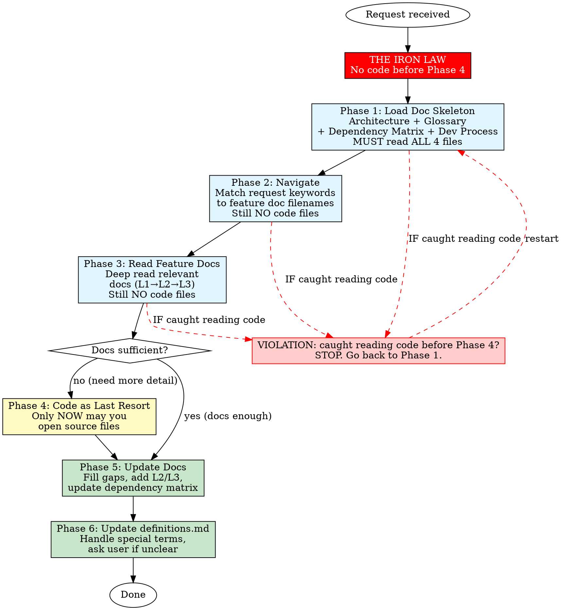

# Doc-Driven Exploration

## THE IRON LAW — NO CODE BEFORE DOCS

**You MUST read ALL mandatory doc files (Phase 1) BEFORE opening any code file.**

This is not optional. This is not "I'll check both." This is not "I already know the codebase."

**Violation means: STOP. Go back to Phase 1. Start over.**

Until Phase 4, you are FORBIDDEN from:
- ❌ Opening any `.py`, `.js`, `.ts`, `.go`, `.rs` file
- ❌ Launching an explore/grep/Task subagent to scan code
- ❌ Running `grep` or `ripgrep` on source directories
- ❌ Reading any file outside `docs/`
- ❌ Using the Task tool to "explore the codebase"
- ❌ Asking "how is X implemented?" — the answer is in the docs

## Why This Rule Exists

Your instinct is to jump to code. That instinct will mislead you.

The docs contain WHY — architecture decisions, business rules, edge cases. Code only tells you WHAT. Reading code first means you build a mental model from implementation details instead of from intent. You will make wrong assumptions, miss edge cases, and produce incorrect work.

**Every time you read code before docs, you are working blind.**

## Overview

Always start with existing documentation before touching source code. The `docs/` folder (created by doc-torn) contains structured knowledge — architecture, glossary, dependency matrix, and detailed feature breakdowns. Documentation is the primary source of truth; code is a last resort.

This skill formalizes how to use documentation effectively as the primary exploration tool before any code is read or written.

## When to Use — ALWAYS Before Any Search

**Every single time** the request involves finding or doing ANY of these:
- Finding a file, class, function, method, or variable
- Finding where something is defined or used
- Finding documentation about a feature or component
- Searching for any information about the project
- Understanding how something works
- Explaining architecture, data flow, or design
- Implementing a new feature or modifying existing code
- Fixing a bug
- Refactoring code
- Onboarding to the codebase

**In short: ANY request that involves the codebase or its documentation MUST start with this skill.**

**Do NOT use** when:
- The task has no code or documentation component (pure configuration, operations)

## Core Workflow



### Phase 1 — Load Doc Skeleton (MANDATORY)

Read these four files **unconditionally, in order, completely** — they are the map of the entire project:

| File | Why |
|------|-----|
| `docs/architecture/architecture.md` | Functional blocks, boundaries, data flows |
| `docs/architecture/dependency-matrix.md` | Which feature depends on what |
| `docs/user/definitions.md` | Business glossary for every named entity |
| `docs/user/dev-process.md` | Conventions, build commands, test patterns |

After reading each file, summarize what you learned. Do NOT proceed to Phase 2 until ALL 4 files are read.

**NO code files. NO grepping. NO Task tool. NO explore subagent.**
These files give you enough context to know WHERE to look next.

### Phase 2 — Navigate to Relevant Docs

Map the request keywords to `docs/features/<name>/` directories:

```
Request: "How does the tool system work?"
→ docs/features/tool-system/README.md

Request: "Add a new CouchDB sync field"
→ docs/features/couchdb-sync/README.md
→ docs/features/couchdb-sync/sub-features/
→ docs/features/couchdb-sync/implementation/
```

**Still NO code files.** You may only read `docs/` files. To find the right feature:
- Match keywords to directory names under `docs/features/`
- Use the dependency matrix to find related features
- Use `docs/architecture/architecture.md` to locate the relevant block
- **Allowed**: glob/search filenames under `docs/` only (e.g. `docs/features/**/*.md`)

If no feature doc matches: check synonyms, check related features in the matrix.
Only after exhausting ALL doc search paths may you consider Phase 4 (code).

### Phase 3 — Read Feature Docs Thoroughly

For each identified feature, read in order:
1. `docs/features/<name>/README.md` — L1: main feature (objective, logic, dependencies, API, key files)
2. `docs/features/<name>/sub-features/*.md` — L2: sub-features, edge cases, business rules
3. `docs/features/<name>/implementation/*.md` — L3: technical decisions, why this approach

Read ALL that exist under the feature folder. Do not skip L2/L3 because "the README covers it."

**If you open a `.py` file during Phase 3, you have violated the Iron Law. STOP. Go back to Phase 1.**

### Phase 4 — Code as Last Resort

Only reach for source code when:
- The documentation explicitly says "see source for details"
- You need a specific implementation detail not covered (line numbers, exact signatures)
- The feature is new and has no docs yet (gap to fill in Phase 5)

**This is the FIRST time you are allowed to open a code file.**

When you must read code:
- Start from the **key files** documented in the feature README
- Read only what's needed — don't deep-dive entire files
- Do NOT launch an explore subagent or Task tool — read the files yourself
- Verify your understanding against docs; update docs if they're wrong

### Phase 5 — Update Documentation

After understanding the code, update the docs to reflect what you learned:

- If you found missing sub-features → add L2 files
- If you understood implementation details → add L3 files
- If dependencies changed → update `dependency-matrix.md`
- If architecture changed → update `architecture.md`
- If new features exist undocumented → add feature docs

### Phase 6 — Handle Special Terms & Update definitions.md

**Special terms** are words the user uses that:
- Are not in `definitions.md`
- Are not standard technical terms
- Could be project-specific jargon or codenames

**Process for special terms:**
1. Search `definitions.md` — is it there?
2. Search `docs/**/*.md` — is it used elsewhere in docs?
3. **Only now**: search the codebase — is it a class/function/variable name?
4. **Only now**: search broader context — could it be a well-known tool/term?

**Do NOT search the codebase until step 3.** Steps 1-2 are doc-only.

**If still unclear after all searches: ask the user once.**
Ask concisely: "What does `<term>` refer to?" One question. No follow-ups.

**Update `definitions.md`:**
- Add new terms found during exploration (from code, from user, from research)
- Refine existing definitions to be more precise
- Remove obsolete entries
- If you added code-level discoveries, write them in business-language terms
- If you learned new tool names or modules, add them

## What a Violation Looks Like

| ❌ Wrong (violation) | ✅ Right (compliant) |
|---------------------|---------------------|
| "Let me explore the codebase to understand..." | "Let me read the documentation to understand..." |
| Launches Task/subagent to grep source code | Reads `docs/architecture/*.md` first |
| Opens `toolbox/tools/core/tool_executor.py` directly | Opens `docs/features/tool-system/README.md` |
| Runs `grep -r "class ToolExecutor" toolbox/` | Reads `docs/architecture/dependency-matrix.md` |
| "I know this project, I'll just check the code" | Re-reads ALL 4 skeleton files before anything |

## Quick Reference

| Phase | Action | Allowed Files | Key Question |
|-------|--------|---------------|-------------|
| 1 | Load skeleton (4 files) | `docs/*.md` only | "Where am I?" |
| 2 | Navigate to feature docs | `docs/features/**/*.md` only | "Where do I look?" |
| 3 | Read feature docs (L1→L2→L3) | `docs/features/**/*.md` only | "How does it work?" |
| 4 | Code only if docs insufficient | Any file | "What detail is missing?" |
| 5 | Update docs with findings | `docs/*.md` + source | "What did I learn?" |
| 6 | Update definitions.md | `docs/user/definitions.md` | "What terms were unclear?" |

## Common Rationalizations

| Rationalization | Reality |
|----------------|---------|
| "I already know how this works" | Code evolves. Docs capture the latest state. Re-read anyway. No exceptions. |
| "I'll just grep it real quick" | Grep gives you code. Docs give you intent. Grep is forbidden until Phase 4. |
| "I'll launch an explore agent to speed things up" | Explore agents scan code, not docs. Forbidden until Phase 4. Read docs yourself. |
| "The feature is simple, no need for docs" | Simple features compound into complexity. Read the docs anyway. |
| "I'll update docs later" | Later never comes. Update in Phase 5 before marking done. |
| "The code is self-documenting" | Code says WHAT, docs say WHY. Read the docs before touching code. |
| "I don't need definitions, I know the terms" | Your understanding ≠ shared understanding. Check definitions.md. |
| "Reading all L2/L3 is overkill" | You don't know what you don't know. L2/L3 cover edge cases you will miss. |
| "I'll ask the user what this term means" | Search docs first. Search code only after docs. Ask only as last resort. |
| "I already read the docs last week" | Docs change. Read them again NOW. Every request starts from Phase 1. |

## Red Flags — STOP and Go Back to Phase 1

- You opened a `.py` file before Phase 4
- You launched a Task/explore subagent to scan the codebase
- You ran `grep` or `ripgrep` on a source directory
- You thought "I know this project" and skipped even one of the 4 skeleton files
- You searched the codebase for a term without checking `definitions.md` first
- You're about to implement something without knowing the full dependency chain
- You skipped `docs/architecture/dependency-matrix.md` because "it's not relevant"
- You're about to ask the user a question you could answer from docs or definitions.md
- You read one doc file and thought "that's enough" — read ALL relevant docs

**All of these mean: STOP. Go back to Phase 1. Read ALL 4 skeleton files. Then proceed.**
