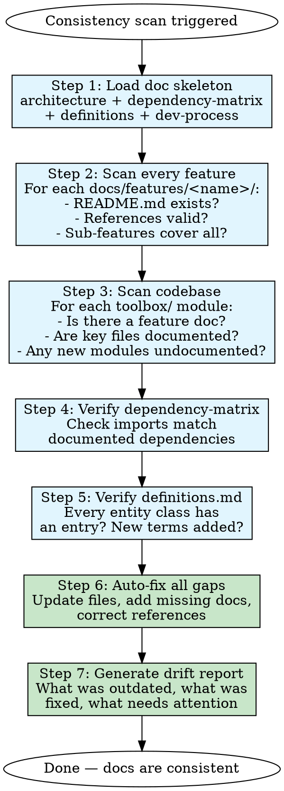

# Documentation Consistency

## The Golden Rule

> **Real code > Documentation. Always.**

Code is reality. Documentation is a model of reality. When they disagree, the model is wrong — not reality.

This skill exists to keep the model accurate. Every fix it makes brings documentation back in line with what the code actually does.

## The Problem

Large documentation inevitably drifts despite the Golden Rule. Features get added without doc updates. Code changes silently invalidate architecture diagrams. The dependency matrix becomes historical fiction. `definitions.md` misses new terms.

Without systematic checks, this drift accumulates until the docs are more misleading than helpful. The fix is not "write better docs" — the fix is **audit regularly and auto-fix**.

## Overview

This skill performs a **full consistency audit** of all documentation against the current codebase, then **auto-fixes every gap found**.

Unlike basic drift checks (which report issues) or single-feature updates, this skill:
- Audits **every** doc file against **every** corresponding code path
- **Auto-fixes** outdated content, missing features, stale references
- Generates a **drift report** of what was changed
- Runs as a complete cycle — not a single-feature update

## When to Use

**Call this skill frequently. Documentation becomes outdated faster than you think.**

### Triggers — every time any of these happens:

**After code changes:**
- A feature was completed, tested, or modified
- New code was added to the codebase
- An existing function/class was refactored
- Imports or dependencies changed
- A file was added, removed, or renamed

**During reasoning (mid-task):**
- You read a doc file and notice it doesn't match the actual code
- You grep for something and the code says something different from the docs
- You find a class/function that exists in code but is not mentioned in any doc
- You encounter a term used in code that isn't in `definitions.md`
- The architecture you see in code doesn't match `architecture.md`

**Periodic schedule:**
- Before every release
- Every 2 weeks during long projects
- When onboarding someone new

### The Golden Rule

**Real code always takes precedence over documentation.**

When code and docs disagree:
1. The code is right by definition — it's what actually runs
2. The documentation is wrong and must be updated
3. Never "fix" code to match outdated docs
4. Always update docs to match the real code

This is non-negotiable. Documentation exists to serve the codebase, not the other way around.

## Workflow



### Step 1 — Load Doc Skeleton

Read the four foundation files (same as `doc-driven-exploration` Phase 1):

| File | Purpose in audit |
|------|-----------------|
| `docs/architecture/architecture.md` | Known architecture — will compare against actual code layout |
| `docs/architecture/dependency-matrix.md` | Known dependencies — will verify imports match |
| `docs/user/definitions.md` | Known glossary — will check all entity classes have entries |
| `docs/user/dev-process.md` | Known process — will verify commands still work |

### Step 2 — Scan Every Feature Doc

For each directory under `docs/features/<name>/`:

**Checklist per feature:**
- [ ] `README.md` exists and is not empty
- [ ] Key files listed in README still exist on disk
- [ ] Dependencies listed in README match actual imports (grep the module)
- [ ] Sub-features directory exists if the feature has multiple capabilities
- [ ] Implementation directory exists if there are non-trivial decisions to document
- [ ] L2/L3 files reference actual functions/classes that exist in code
- [ ] No file in `docs/features/<name>/` is >90 days old without modification

**Auto-fix rules:**
| Condition | Action |
|-----------|--------|
| README missing | Create from code exploration |
| Key file in README does not exist | Remove or update reference |
| Missing sub-feature doc | Create L2 doc with code findings |
| Missing implementation doc | Create L3 doc with code findings |
| File too old without changes | Flag for review, update if code changed |

### Step 3 — Scan Codebase for Undocumented Features

**Before scanning, perform an exhaustive codebase traversal** to guarantee no file is missed:

- List all files and directories at the project root
- For each file → add `todowrite` task `"Lire fichier <path>"`
- For each directory → add `todowrite` task `"Lister dossier <path>"`
- Process tasks **one by one**: when a `"Lister dossier <path>"` runs, list its contents and add new `"Lire fichier"` / `"Lister dossier"` tasks for everything found inside
- **Repeat until the todo list is empty** — every nested file is visited; no depth limit, no early stop

> **Red flag — STOP:** Any thought of skipping nested directories ("deep enough", "probably not relevant") means you must continue. The todo list drives discovery, not your intuition.

Then, for each directory discovered by the traversal, verify documentation coverage:

**Scan target:** `toolbox/<module>/` directories, `external_tools/external_parsers/<tool>/`

- [ ] Does `docs/features/<module-name>/` exist?
- [ ] If not: is the module significant enough to document?
- [ ] Are newly added tools parsers documented?
- [ ] Are there files that reference classes/functions not in any doc?

**Auto-fix rules:**
| Condition | Action |
|-----------|--------|
| Significant module with no doc | Create feature doc (L1 + sub-features + implementation) |
| New external tool parser | Add to external-tools docs |
| Undocumented class/function referenced in docs | Add to definitions.md or feature doc |

### Step 4 — Verify Dependency Matrix

Cross-check `docs/architecture/dependency-matrix.md` against actual code:

- For each feature: grep its module for imports from other modules
- Does the "depends on" column match?
- Does the "used by" column match?
- Are there any undocumented cross-feature imports?

**Auto-fix rules:**
| Condition | Action |
|-----------|--------|
| Missing dependency | Add row to matrix |
| Removed dependency | Remove or mark as legacy |
| Undocumented cross-import | Add to matrix if significant |

### Step 5 — Verify Definitions

Cross-check `docs/user/definitions.md` against actual code entities:

- For each entity class in `toolbox/core_structures/`: is it in definitions?
- For each major exception/error class: should it be defined?
- For each tool name referenced in docs: is it in definitions?
- For each term the user has used in this session: is it defined?

**Auto-fix rules:**
| Condition | Action |
|-----------|--------|
| Entity class without definition | Add entry to definitions.md |
| Obsolete definition | Update or mark deprecated |
| User-used term not defined | Add definition |

### Step 6 — Auto-Fix All Gaps

For every issue found in Steps 2-5, fix it immediately. Do NOT create a "to-do later" list. The whole point of this skill is that **later never comes**.

**Write now:**
- Missing feature docs
- Updated dependency matrix
- Expanded definitions
- Corrected architecture
- New sub-feature / implementation docs

### Step 7 — Generate Drift Report

After fixing, produce a summary of what was found and fixed:

```markdown
## Documentation Consistency Report

**Date**: <date>
**Duration**: <time elapsed>

### Fixed
- Feature X README: updated key files list (removed 2 obsolete, added 1)
- Dependency matrix: added Y → Z dependency
- definitions.md: added 3 new terms
- New feature doc created: <name>
- L2 sub-feature added: <name>

### Requires Attention
- Architecture.md: the diagram doesn't show the new CouchDB sync flow
- Feature A: sub-features directory exists but is empty

### Clean
- 12/15 features fully consistent
- definitions.md complete
```

## Quick Reference

| Step | What | Auto-fix? | Key Question |
|------|------|-----------|-------------|
| 1 | Load skeleton | No (reference only) | "What should be true?" |
| 2 | Scan feature docs | Yes | "Does each doc match reality?" |
| 3 | Scan codebase | Yes | "What is undocumented?" |
| 4 | Verify dependency matrix | Yes | "Do imports match the matrix?" |
| 5 | Verify definitions | Yes | "Are all entities defined?" |
| 6 | Auto-fix gaps | Yes (this step) | "What needs writing now?" |
| 7 | Generate report | Yes | "What changed?" |

## Common Rationalizations

| Rationalization | Reality |
|----------------|---------|
| "I updated the feature, the doc is fine" | One change cascades. Dependencies shift. Definitions stale. Always run the full audit. |
| "The docs are mostly correct" | "Mostly correct" means partially wrong. Run the audit. |
| "I'll fix issues as I find them" | You won't find them without a systematic scan. Run the audit. |
| "The dependency matrix is close enough" | Close enough = wrong. grep the imports. |
| "It's just a small project, docs can't drift much" | Small projects drift fastest. One undocumented feature = 25% of your features undocumented. |
| "I'll add the definition when I use the term" | You'll forget. Add it in the audit. |

## Red Flags — STOP and Audit

- A feature README hasn't been touched since its creation date
- You don't know if `definitions.md` lists all current entity types
- The architecture diagram feels "roughly right" but you're not sure
- New files were added to the codebase this week without doc updates
- You're about to onboard someone and don't know if the docs are accurate
- Someone asked "is feature X documented?" and you had to check
