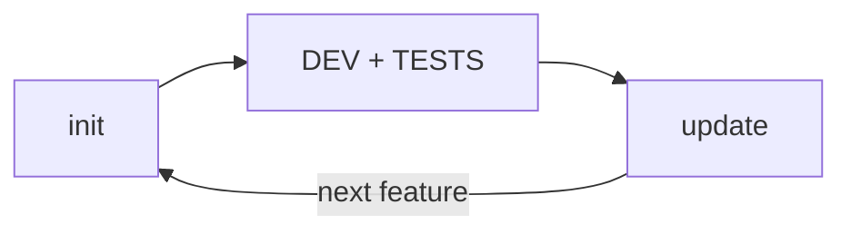

# Doc-Torn: Continuous Documentation

## EXECUTE NOW — DO NOT WAIT FOR USER

**This skill was loaded because documentation work is needed. Do NOT wait
for the user to tell you what to do. Do NOT say "I await your request."
Do NOT list options. Determine the mode and execute it RIGHT NOW.**

### Critical: manual trigger ≠ wait for feature
The user explicitly loaded (spawned) this skill. This is a **manual action**
that means: "structured-documentation, do a full documentation pass on this project now."
It does NOT mean "wait until I ask for a specific feature."

If the user manually invoked structured-documentation (not auto-triggered by feature context),
run a **full documentation cycle**:
1. Run `init` for everything missing (L0, architecture, features, definitions, dev-process)
2. If AGENTS.md exists but is partial, update it
3. Run `update` for existing docs — sync with current code state

Partial docs (like only API.md + SECURITY.md) is NOT a reason to wait.
It's a reason to **fill the gaps**. The skill was loaded to fix that.

### Rule 1: No waiting, no options menu
If you think "the user hasn't said anything yet" — STOP. The user loading this
skill IS the request. Your first message after loading must be action, not
questions. Never say "what would you like me to do?" or "how can I help?".
Determine the mode and go.

### Rule 2: Only ask about unknown terms
If the user used a word you genuinely don't understand (project codename,
unfamiliar framework), ask once: "What does `<term>` refer to?"
Then proceed immediately. One question max.

### Rule 3: Pick your mode — now
Look at the project, look at the user message, and decide:
- **Manual spawn (user loaded skill directly)** → FULL CYCLE: init missing pieces → update existing. Do not wait for a feature.
- **`init`** → no `docs/` folder exists → fully autonomous: explore codebase,
  discover all features, write ALL doc files (L0 → L1 → arch → matrix →
  definitions → dev-process → AGENTS.md). No pausing between steps.
- **`update`** → after completing a feature or when docs need syncing → sync docs with code
- **Unsure?** → check if user manually spawned the skill. If yes → full cycle.
  If no → `init` if no docs/ folder, `update` if docs exist but may be stale.

### Rule 4: Execute to completion — no confirmation stops
Once the mode is set, run every step of its workflow. Do NOT stop to say
"shall I continue?" or "is this what you wanted?" or "I've finished step X,
should I proceed?". Just do it all. The user will tell you if they want changes.

### Rule 5: Your first output is the work, not a question
Your very first message after loading this skill should be the work itself
— exploring the project, or presenting what you've found, or confirming
what mode you're executing. Never a question asking the user what to do.

**The only acceptable question: asking what an unfamiliar term means (Rule 2).
Everything else: STOP asking. START doing.**

---

## Overview

Doc-Torn maintains structured documentation that stays **always in sync**
with the code. Documentation follows a general-to-detailed hierarchy
(L0 → L1 → L2 → L3) with an explicit dependency matrix between features.

## Project Files

```
AGENTS.md                         # Agent cheat sheet: stakes, features index, rules
docs/
  README.md                        # L0: Lightning overview (5 min)
  architecture/
    architecture.md                 # Functional blocks, flows, boundaries
    dependency-matrix.md            # Dependencies between features
  features/
    <feature-name>/
      README.md                    # L1: Main feature
      sub-features/
        <detail>.md                # L2: Sub-feature
      implementation/
        <detail>.md                # L3: Implementation detail
  user/
    definitions.md                 # Evolving business glossary
    dev-process.md                 # Dev conventions, validation practices
```

## Lifecycle



| Mode | When | Action |
|------|------|--------|
| `init` | First time | **ITERATIVE** — Use doc-torn-scan for feature-by-feature discovery and documentation. 3 phases: discovery, feature iteration, meta-docs. See below. |
| `update` | After each feature | Update impacted docs, recalculate dependencies |

## Principles

1. **Sync after every feature** — documentation is never outdated
2. **Lightweight templates** — enough structure, no bureaucracy
3. **General to detailed** — L0 → L1 → L2 → L3
4. **Why, not how** — code is the reference for comments

## Detailed Workflow

### Mode `init` — First-time documentation (ITERATIVE)

**Prerequisite:** Ensure `doc-torn-scan` is installed:
```bash
which doc-torn-scan || ([ -d /opt/doc-torn ] || sudo git clone https://github.com/Anhydrite/doc-torn /opt/doc-torn) && cd /opt/doc-torn/tools/doc-torn-scan && go build -o ~/.local/bin/doc-torn-scan .
```

**Do not ask the user for permission or confirmation between steps.**
From the moment this mode starts, you explore, decide, and produce everything
on your own. Only the user can stop you — you never pause to ask "what next?".

**Phase 1 — Discovery (agent-driven)**

Run `doc-torn-scan tree` to get the full file tree as JSON.
Study the output to identify features — a feature is a logical unit of functionality,
not necessarily a directory. Name features with business-meaningful names.

Write `.doc-torn-state.json` with:
- Feature name, source files, sub-features, implementation details
- Dependencies between features (which feature depends on which)
- Topological order (dependencies documented first, dependents after)

**Phase 2 — Itération feature par feature**

Repeat until all features are completed:

1. Read the source files for the current feature
2. Understand the code (structure, logic, edge cases, business rules)
3. Run `doc-torn-scan scaffold <feature-name>`
4. Open each generated file and replace `<!-- EXPLANATION -->` sections with real content (the "why")
5. Run `doc-torn-scan complete <feature-name>`
6. Commit if desired

**Phase 3 — Méta-docs**

When all features are complete:
1. Run `doc-torn-scan meta`
2. Review and adjust generated files:
   - docs/README.md (L0) — verify one-line summary, architecture diagram, feature list
   - docs/architecture/architecture.md — verify block diagram, add data flows
   - docs/architecture/dependency-matrix.md — verify dependencies
   - docs/user/definitions.md — add missing terms
   - docs/user/dev-process.md — add build/test commands
   - AGENTS.md — verify stakes, rules, architecture
3. Run `doc-torn-scan status` to confirm completion


### Mode `update` — After a feature

1. Identify the impacted (or new) feature
2. Run `doc-torn-scan tree` to capture the current filesystem state.
   Study the output to confirm which files exist under `docs/features/<name>/`,
   then verify the structure matches the expected template:
   - `README.md` (L1)
   - `sub-features/` (L2) — one `.md` per sub-feature
   - `implementation/` (L3) — one `.md` per implementation detail
3. Create/Update `docs/features/<name>/README.md` (L1)
4. Create/Update **L2 (sub-features)** and **L3 (implementation details)** for the feature
5. Recalculate and update `dependency-matrix.md`
6. If new business terms emerged, add them to `definitions.md`
7. If the dev process changed, update `dev-process.md`
8. Update `docs/README.md` (L0) if the list of major features changed
9. If the functional architecture is impacted, update `architecture.md`
10. Update `AGENTS.md` at project root:
    - Refresh feature index with any new/removed features
    - Update architecture diagram if changed
    - Update business stakes if the project scope evolved
11. **Structural verification** — run `doc-torn-scan tree` again and
    compare the output against the expected doc template. If any expected
    files are missing (e.g. a feature dir with no README.md), fix before
    marking the update complete.

**⚠️ Change size ≠ update importance.** Even a single function addition
must sync the documentation. "It's a small change" is not an excuse
to skip steps.


## Templates

### L0 — docs/README.md

    # <Project Name>
    
    ## In one line
    
    ## Architecture
    
    ```mermaid
    graph TD
        Client --> API
        API --> Auth
        API --> Catalog
        API --> Cart
        Cart --> Payment
        Auth --> DB[(Database)]
        Catalog --> DB
        Cart --> Cache[(Redis)]
        Payment --> Stripe[Stripe API]
    ```
    
    ## Major Features
    - [Feature A] — description
    - [Feature B] — description
    
    ## External Dependencies

### L1 — docs/features/<name>/README.md

```markdown
# <Feature Name>

## Functional Objective

## Technical Logic

## Dependencies
- **Upstream**: what this feature depends on
- **Downstream**: what depends on this feature

## API / Interface

## Key Files
```

### Architecture — docs/architecture/architecture.md

    # Functional Architecture
    
    ## Block Diagram
    
    ```mermaid
    graph TD
        Client[Browser] --> Gateway[API Gateway]
        Gateway --> Auth[Auth]
        Gateway --> Catalog[Catalog]
        Gateway --> Cart[Cart]
        Cart --> Payment[Payment]
        Auth --> DB[(Primary DB)]
        Catalog --> DB
        Cart --> Cache[(Redis)]
        Catalog --> Search[Meilisearch]
        Payment --> Stripe[Stripe API]
    ```
    
    ## Data Flows
    
    ```mermaid
    sequenceDiagram
        User->>API: POST /login
        API->>DB: verify credentials
        DB-->>API: user + roles
        API->>User: JWT token
    ```
    
    ## Key Boundaries
    - <boundary description>

### AGENTS.md — Project root (generated by init, updated by update)

    # <Project> — Agent Guide
    
    ## Business Stakes
    <why this project exists, who it serves, business impact>
    
    ## Features
    - [Feature A](docs/features/feature-a/README.md) — objective, key dependencies
    - [Feature B](docs/features/feature-b/README.md) — objective, key dependencies
    
    ## Architecture in 30s
    See `docs/architecture/architecture.md` for the full diagram.
    
    ## Rules
- Document a new project → structured-documentation `init`
- After each feature → structured-documentation `update`
    
    Glossary: docs/user/definitions.md

### L2 / L3 — Details

No strict template. Principle:
- Explain the **WHY**, not the HOW
- Why this technical choice, which edge case is handled, what business rule applies
- Source code is the reference for comments

## Common Rationalizations

| Excuse | Reality |
|--------|---------|
| "A few cross-cutting files are enough" | Without feature-level breakdown, docs are impossible to maintain |
| "The code is self-documenting" | Code says WHAT it does, not WHY it does it |
| "I'll document features later" | "Later" never comes. Do it now |
| "Dependencies are obvious" | They stop being obvious once the project grows |
| "README in project root is standard" | Project README talks about the project. Docs talk about the code |
| "The structure is obvious from the folders" | Only if you already know the codebase |
| "It's a small change, no need for full update" | Every change deserves an update. "Small" compounds into "mess" |
| "I already know the codebase" | Docs evolve. Re-read before every feature — always |
| "I'll document everything in one pass" | One pass saturates context, loses details. Use doc-torn-scan iteratively, feature by feature. |

## Red Flags

- You're using 3-4 cross-cutting files instead of per-feature breakdown
- You're mixing implementation details with high-level vision in the same file
- You can't quickly tell which feature depends on which
- Docs talk about **how** instead of **why**
- You catch yourself thinking "I'll add details later"
- README.md is at project root instead of docs/README.md
- No definitions.md or dev-process.md files exist
- You're documenting everything at the same level of detail with no hierarchy
- You're about to implement a feature without reading the docs first
- You're trying to document everything in one pass instead of iterating feature by feature
